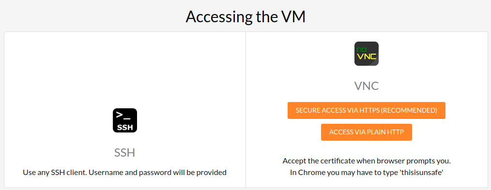
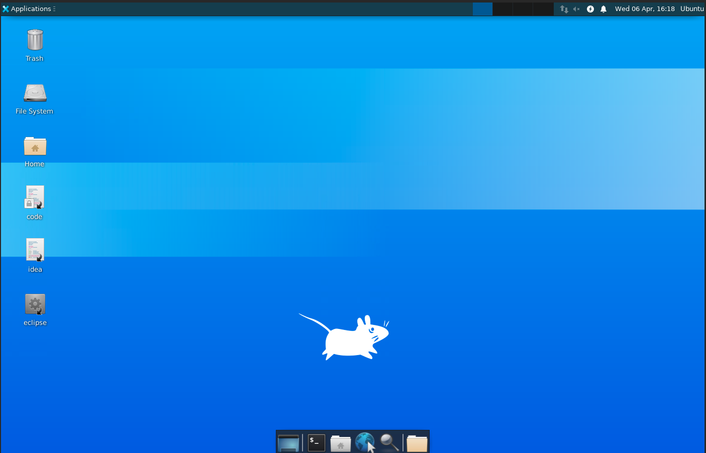
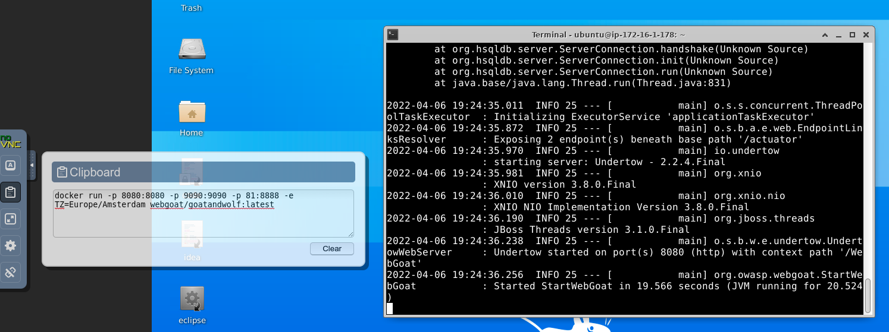

# Lab setup

* For the virtual machine to run the lab, you will be given an IP and the password. 

* You will click on VNC access and enter the password. You will then have access to an Ubuntu VM.

### Background information

* We will be using Goat security labs, described [here](https://owasp.org/www-project-webgoat/)

* However, it comes with security warning. Therefore, this is an instruction on running the labs securely.

## Instructions on running the labs

### Start the labs in Docker

1. Open a terminal window
2. Using the clipboard, enter the following

   `docker run -p 8080:8080 -p 9090:9090 -p 81:8888 -e TZ=Europe/Amsterdam webgoat/goatandwolf:latest`

### Open labs in the browser

3. Open the browser in your VM, point to `localhost:8080/WebGoat`

4. Register as a new user.
   
* FYI Goal Labs solutions
* https://github.com/WebGoat/WebGoat/wiki/(Almost)-Fully-Documented-Solution-(en)

## Instructor:

* Every student gets this
* ubuntu-clean-desktop-v1
