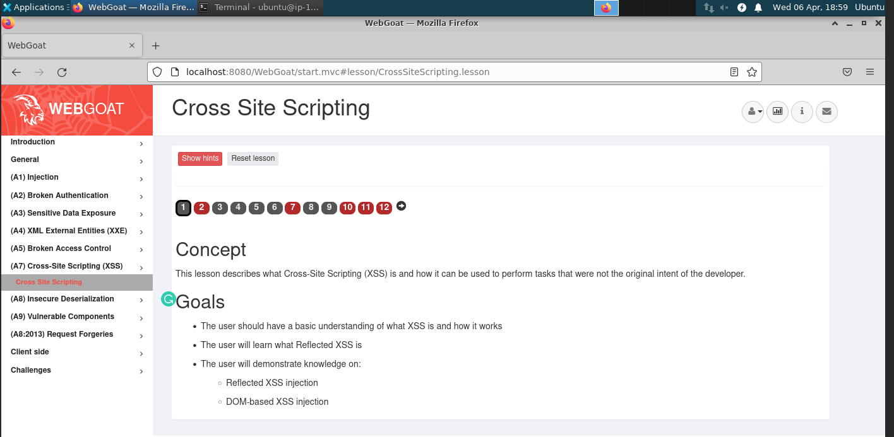

# Lab setup

* This lab shows the Cross-Site Scripting attack and defences. 

### Depends on
[Lab01-Setup](../Lab01-Setup)

### Lab description
* Go to the VM that you have set up in the [Lab01-Setup](../Lab01-Setup)
* Open the XSS lab

* Follow the lab instructions